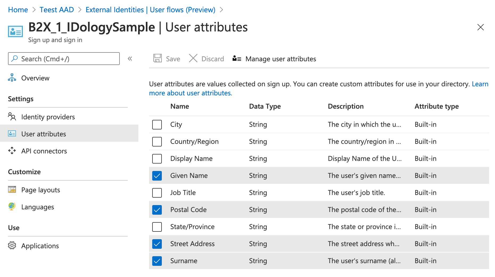
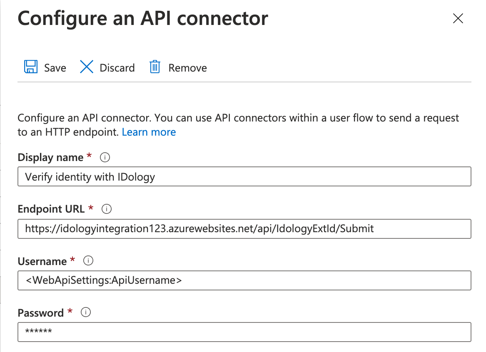
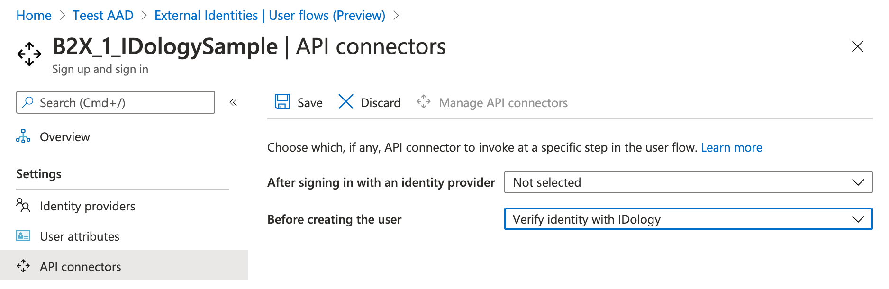

# IDology External Identities self-service sign-up API connector integration

Azure Active Directory (Azure AD) External Identities enable you to provide [self-service sign-up](https://docs.microsoft.com/azure/active-directory/b2b/self-service-sign-up-overview) for external users so that collaboration is seamless and end-user friendly. [API connectors](https://docs.microsoft.com/azure/active-directory/b2b/api-connectors-overview) enable you to leverage web APIs to integrate those self-service sign-up flows with external cloud systems.

Verifying a user's identity can be critical to securing an application from fraudulent and malicious actors and confidently allowing self-service sign-up. To accomplish this, you can use IDology's identity verification and proofing service including ID verification, Fraud prevention, Compliance, and other solutions.

## Contents

Outline the file contents of the repository. It helps users navigate the codebase, build configuration and any related assets.

| File/folder       | Description                                |
|-------------------|--------------------------------------------|
| `RestApi/Api`             | Sample source code for API.                        |
| `.gitignore`      | Define what to ignore at commit time.      |
| `CHANGELOG.md`    | List of changes to the sample.             |
| `CONTRIBUTING.md` | Guidelines for contributing to the sample. |
| `README.md`       | This README file.                          |
| `LICENSE`         | The license for the sample.                |

## Prerequisites

You must have an [Azure Active Directory tenant](https://docs.microsoft.com/azure/active-directory/develop/quickstart-create-new-tenant).

## Solution Components

The IDology integration is comprised of the following components:
- IDology -- The IDology service takes inputs provided by the user and
    verifies the user's identity.
- Custom web API -- This provided API implements the integration
    between the Azure AD self-service sign-up user flow and the IDology service to perform identity proofing at sign-up.
- Azure AD External Identities self-service sign-up - The way to allow external customers to sign-up as external users to your organization.
- API connector - Part of a self-service sign-up, allows you to connect the sign-up flow with the custom web API.

## Create an IDology account

When you are ready to get an IDology account, sign up using [this]https://www.idology.com/request-a-demo/microsoft-integration-signup/) web form.

## Deploy the API

Deploy the provided API code to an Azure service. The code can be
published from Visual Studio, following these
[instructions](https://docs.microsoft.com/visualstudio/deployment/quickstart-deploy-to-azure?view=vs-2019).

Note the URL of the deployed service. This will be needed to configure the API connector with the required settings.

### Configure the API

Application settings can be [configured in the App service in
Azure](https://docs.microsoft.com/azure/app-service/configure-common#configure-app-settings).
This allows for settings to be securely configured without checking them
into a repository. The API needs the following settings configured:

| Application Setting Name    | Source                                 |
| --------------------------- | -------------------------------------- |
| IdologySettings:ApiUsername | IDology service username.              |
| IdologySettings:ApiPassword | IDology service password.              |
| WebApiSettings:ApiUsername  | Set a username for accessing the API. |
| WebApiSettings:ApiPassword  | Set a password for accessing the API. |

## Integrate the API with External Identities self-service sign-up

### Configure a self-service sign-up user flow

[Create a self-service sign-up user flow](https://docs.microsoft.com/azure/active-directory/b2b/self-service-sign-up-user-flow) for registering external users to your tenant.

Under **User Attributes**, the following must be selected in order to collect the information from the user:

### Create an API Connector

After the Azure AD tenant has been configured for use with External
Identities, [create an API connector](https://docs.microsoft.com/azure/active-directory/b2b/self-service-sign-up-add-api-connector#create-an-api-connector)

- **Display Name**: Choose a name such as 'Verify identity with IDology'.
- **Endpoint URL**: Use the URL created when publishing the API service.
- **Username**: Username defined in the API configuration above (WebApiSettings:ApiUsername)
- **Password**: Password defined in the API configuration above (WebApiSettings:ApiPassword)
- **Claims to Send**
    - Given Name
    - Surname
    - Street Address
    - Postal Code

The API connector configuration should look like the following:

### Enable the API connector in the user flow

Enable the API connector for the user flow. Navigate to **User flows (Preview)**, click the user flow you created, and click on **API connectors**. From here, click on the drop-down menu for **Before creating the user** and select the API connector (e.g. 'Verify identity with IDology').

## End user experience

Your self-service sign-up user flow should now be calling out the API, which uses the IDology service to verify an account. If the user cannot be verified, the user will be shown an error message and asked to review their personal information.

## Contributing

This project welcomes contributions and suggestions.  Most contributions require you to agree to a
Contributor License Agreement (CLA) declaring that you have the right to, and actually do, grant us
the rights to use your contribution. For details, visit https://cla.opensource.microsoft.com.

When you submit a pull request, a CLA bot will automatically determine whether you need to provide
a CLA and decorate the PR appropriately (e.g., status check, comment). Simply follow the instructions
provided by the bot. You will only need to do this once across all repos using our CLA.

This project has adopted the [Microsoft Open Source Code of Conduct](https://opensource.microsoft.com/codeofconduct/).
For more information see the [Code of Conduct FAQ](https://opensource.microsoft.com/codeofconduct/faq/) or
contact [opencode@microsoft.com](mailto:opencode@microsoft.com) with any additional questions or comments.